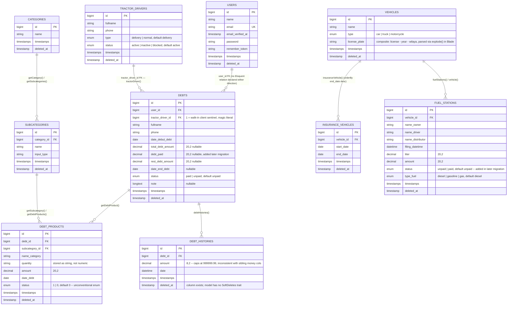

# DOMAIN MODEL — ABK Construction Supplies

Entities, columns, and relations as declared in the migrations (`database/migrations/*.php`) and Eloquent
models (`app/Models/*.php`). Framework-only tables (`password_resets`, `failed_jobs`,
`personal_access_tokens`) are omitted — they carry no domain meaning.

For how these entities are actually manipulated (which controllers, which broken paginate/validation paths),
see the per-module files under [`MODULES/`](./MODULES/). This document is schema + relations only.

---

## Entity-relationship diagram

---

## Entities

### User (`users`)
`app/Models/User.php:13` — `Illuminate\Foundation\Auth\User`, traits `HasApiTokens`, `HasFactory`,
`Notifiable`, `SoftDeletes`, `SoftCascadeTrait`. `$fillable = ['name','email','password']` (`:22-26`).
`$casts = ['email_verified_at' => 'datetime']` — the **only** model in the codebase with any `$casts`
(`app/Models/User.php:43-45`). **No relations declared** — despite `debts.user_id` existing as a foreign key,
there is no `debts()` method on `User` and no `user()` method on `Debt`
(`[CONFIRMED-via-raw app/Models/User.php — no relations, app/Models/Debt.php:15 — user_id in $fillable, no relation]`).
Ownership of a debt record is stored but not navigable in either direction. `SoftCascadeTrait` is applied
with no `$softCascade` property — cascade scope is undefined from this file alone.

### TractorDriver (`tractor_drivers`)
`app/Models/TractorDriver.php:10`. `$fillable = ['fullname','phone','type','status']`. One declared relation:
`debts()` → `hasMany(Debt::class)` (`:22-25`). This table serves **two conceptual roles** that the schema does
not distinguish:
1. The literal "tractor driver" / delivery-driver entity (`type = 'delivery'`).
2. The **client/supplier discriminator sentinel** for `Debt` — row `id = 1` means "walk-in client, no real
   driver"; every other row means "supplier debt". This split is a hardcoded literal, not a column
   (`ARCHITECTURE.md` §2, V11).
3. The de-facto **Supplier** entity — `SupplierSeeder` seeds `TractorDriver` rows to represent suppliers
   (`database/seeders/SupplierSeeder.php`); there is no `Supplier` model, table, or repository anywhere in the
   codebase (`docs/audit/raw/04-catalog.md`).

### Debt (`debts`)
`app/Models/Debt.php:10` — the domain hub (`ARCHITECTURE.md` Wall 2). Traits `HasFactory`, `SoftDeletes`,
`SoftCascadeTrait`. `$softCascade = ['getDebtProduct']` (`:28`). Relations: `getDebtProduct()` → `hasMany(DebtProduct)`
(`:30-33`), `tractorDriver()` → `belongsTo(TractorDriver, 'tractor_driver_id')` (`:35-38`), `debtHistories()`
→ `hasMany(DebtHistory)` (`:69-72`). Also carries four static reporting aggregates
(`getTotalDebt/getTotalPaidDebt/getTotalRestDebt/getDebtTimeline`, `:40-67`) that are **unfiltered by
`tractor_driver_id`**, i.e. they silently sum client and supplier debt together — consumed by the dashboard
(see `MODULES/dashboard-analytics.md`). The same table backs two parallel UI modules (Debt = client,
DebtSupplier = supplier) discriminated only by `tractor_driver_id != 1` — there is no `type` or
`debtor_kind` column.

### DebtProduct (`debt_products`)
`app/Models/DebtProduct.php:10` — one line item per debt. Traits `HasFactory`, `SoftDeletes`,
`SoftCascadeTrait`. Relations: `getDebt()` → `belongsTo(Debt)` (`:24-27`), `getSubcategory()` →
`belongsTo(SubCategory, 'subcategory_id')` (`:29-32`). `quantity` is a `string` DB column despite being
numeric (`database/migrations/2024_09_19_164340_create_debt_products_table.php:21`). `status` is
`enum(1,0)` (`:24`) — an integer-valued enum, unconventional; no named constant backs it.

### DebtHistory (`debt_histories`)
`app/Models/DebtHistory.php:8` — payment audit trail, one row per `payDebt()` call. Traits `HasFactory` only
— **no `SoftDeletes`**, even though its migration creates a `deleted_at` column
(`database/migrations/2025_08_18_144113_create_debt_histories_table.php:22`); `delete()` on this model
hard-deletes. Relation: `debt()` → `belongsTo(Debt)` (`:18-21`). `amount` is `decimal(8,2)` — smaller
precision than every other money column in the schema (`decimal(20,2)`), capping representable history
amounts at 999,999.99.

### Category (`categories`)
`app/Models/Category.php:10` — top level of the two-level materials catalog. `$fillable = ['name']`.
`$softCascade = ['getSubcategories']` (`:18`). Relation: `getSubcategories()` → `hasMany(SubCategory)` (`:20-23`).

### SubCategory (`subcategories`)
`app/Models/SubCategory.php:11` — second catalog level; the actual line-item source for `DebtProduct`.
`$fillable = ['category_id','name','input_type']`. Relations: `getCategory()` → `belongsTo(Category,
'category_id')` (`:21-24`), `getDebtProducts()` → `hasMany(DebtProduct)` (`:26-29`) — the edge that links
Catalog into Debt. Accessor `getDisplayNameAttribute()` (`:31-34`) maps rebar-size name values
(`1/4, 2/4, 3/4, 4/4 = 1`) to the Arabic label `ريموك` — see `GLOSSARY.md`.

### Vehicle (`vehicles`)
`app/Models/Vehicle.php:11` — fleet root. `$fillable = ['name','type','license_plate']`.
`$softCascade = ['insuranceVehicle','fuelStations']` (`:21`) — the only delete-integrity declaration for
the fleet subtree (`ARCHITECTURE.md` Wall 5). `license_plate` is a **single string column** storing three
logical sub-fields concatenated as `"{license} - {year} - {wilaya}"`
(`app/Http/Controllers/Vehicle/VehicleController.php:57,140`), decoded back via `explode(' - ', ...)` in
Blade (`resources/views/content/Vehicle/edit.blade.php:34-42`) rather than stored as three columns or
decoded by a model accessor. Relations: `fuelStations()` → `hasMany(FuelStation)` (`:23-26`),
`insuranceVehicle()` → `hasMany(InsuranceVehicle)->orderBy('end_date','desc')` (`:28-31`). Also declares
`insuranceDateExpiredLast(): bool` (`:33-44`) which **bypasses** its own `insuranceVehicle()` relation and
re-queries `InsuranceVehicle` directly — see `MODULES/vehicle-fleet.md`.

### InsuranceVehicle (`insurance_vehicles`)
`app/Models/InsuranceVehicle.php:11` — one row per insurance period for a vehicle. `$fillable =
['vehicle_id','start_date','end_date']`. Relation: `vehicle()` → `belongsTo(Vehicle)` (`:21-24`). Two
expiry-check methods: `insuranceDateExpired()` (row-scoped, correct) and `insuranceDateExpiredLast()`
(`:30-41`, **no `vehicle_id` filter** — returns the latest `end_date` across every vehicle in the table, not
just this record's vehicle).

### FuelStation (`fuel_stations`)
`app/Models/FuelStation.php:11` — one fuel receipt per fill-up, billed to a vehicle. Traits `HasFactory`,
`SoftDeletes`, `SoftCascadeTrait`, `Laravel\Scout\Searchable` (`:13`). `$fillable`: `vehicle_id, name_owner,
name_driver, name_distributor, filing_datetime, liter, amount, status, type_fuel` (`:15-25`). Relation:
`vehicle()` → `belongsTo(Vehicle)` (`:28-31`). `toSearchableArray()` (`:38-49`) indexes 7 fields into Scout.
Carries 11 static reporting aggregates (`getTotalPaidFuel`, `getTotalLiterTypeDiesl` [sic], etc., `:51-112`)
— see `MODULES/fuel-station.md` and `MODULES/dashboard-analytics.md`.

---

## Conceptual entities with no table

| Concept | How it's actually represented |
|---|---|
| **Client vs Supplier debtor** | Not a column. `debts.tractor_driver_id = 1` = client; any other value = supplier. Repeated as a bare literal in 6 places (`ARCHITECTURE.md` V11). |
| **Supplier** | Not a model/table. UI label over `tractor_drivers` rows (`type` column, or simply "not id 1" in the Debt context). `SupplierController`/`SupplierRepository` exist as dead, unroutable code referencing a repository interface with no implementation (`docs/audit/raw/04-catalog.md`). |

## Cross-module foreign keys (summary)

| Child table | FK column | Parent table | On delete |
|---|---|---|---|
| `debts` | `user_id` | `users` | cascade (hard-delete only) |
| `debts` | `tractor_driver_id` | `tractor_drivers` | cascade (hard-delete only) |
| `debt_products` | `debt_id` | `debts` | cascade (hard-delete only) |
| `debt_products` | `subcategory_id` | `subcategories` | cascade (hard-delete only) |
| `debt_histories` | `debt_id` | `debts` | cascade (hard-delete only) |
| `subcategories` | `category_id` | `categories` | cascade (hard-delete only) |
| `insurance_vehicles` | `vehicle_id` | `vehicles` | cascade (hard-delete only) |
| `fuel_stations` | `vehicle_id` | `vehicles` | cascade (hard-delete only) |

All child tables also `softDeletes()`. Native `cascadeOnDelete()` FK constraints only fire on hard deletes;
soft-delete cascading (the normal delete path in this app, since every controller calls `->delete()`, not
`->forceDelete()`) depends entirely on `askedio/laravel-soft-cascade` being active, which is unconfirmed —
see `ARCHITECTURE.md` §7.
