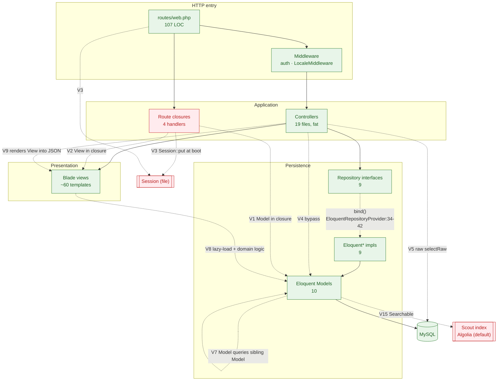
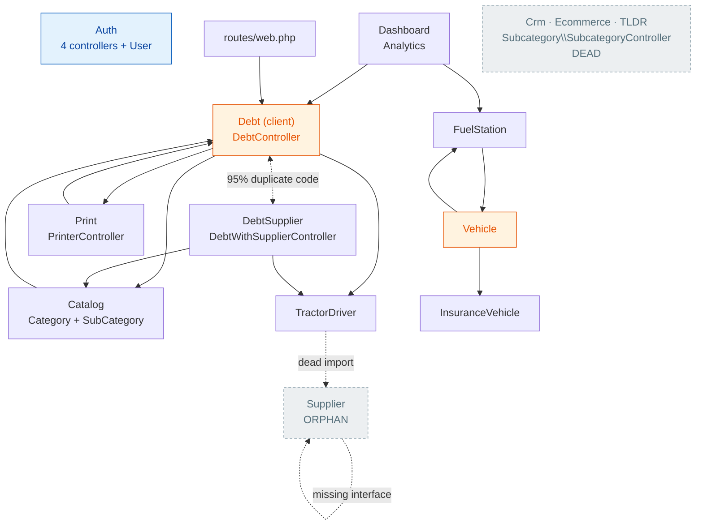

# ARCHITECTURE — ABK Construction Supplies

**As-built, not as-claimed.** Derived from `docs/audit/raw/01..08` and verified by targeted source reads.
Every claim is tagged `[CONFIRMED path:line]` (I read it) or `[ASSUMED]` (inferred, not provable statically).

Laravel 9 / PHP 8.0.2+. 19 controller files, 10 models, 9 repository interface+impl pairs, ~60 Blade templates.
`app/` contains exactly six directories: `Console, Exceptions, Http, Models, Providers, Repositories`
`[CONFIRMED — ls app/]`.

---

## 1. Pattern in use

The team's stated pattern is **Repository**. That is half-true: a repository *layer* exists and is wired,
but it is a passthrough DAO with no domain semantics, and four live request handlers plus three route
closures bypass it entirely.

**What does NOT exist anywhere in the codebase** `[CONFIRMED — ls returned "No such file or directory" for all]`:

| Absent | Consequence |
|---|---|
| `app/Services` | No service layer. Business rules live in controllers. |
| `app/Actions` | No action classes. |
| `app/Jobs`, `app/Events`, `app/Listeners` | Nothing runs async or event-driven. |
| `app/Policies` | No authorization layer beyond "logged in / not logged in". |
| `app/Observers` | No model lifecycle hooks. |
| `app/DTO` (or any DTO namespace) | Untyped arrays flow from `$request->all()` into `Model::create()`. |
| `app/Http/Requests` | Zero FormRequests. 100% inline validation. |
| Livewire | Not in `composer.json` or `package.json` `[CONFIRMED — grep -i livewire]`. |

### Breakdown by live request handler

Counted over the 48 routed handlers that touch data or render domain state (excludes dead/unroutable
controllers: `Crm`, `Ecommerce`, `TLDRController`, `Subcategory\SubcategoryController`, `Supplier\SupplierController`).

| Pattern | Share | Count | Evidence |
|---|---:|---:|---|
| **Repository-mediated MVC** (Controller → RepositoryInterface → Eloquent* → Model) | **81%** | 39 | Category(4), Category\SubCategory(1), Debt(8), DebtWithSupplier(8), FuelStation(7), Vehicle(6), TractorDriver(4), Printer(1) `[CONFIRMED app/Providers/EloquentRepositoryProvider.php:34-42]` |
| **Classic MVC / Active Record** (Controller → Model directly, repository bypassed) | **10%** | 5 | `Analytics@index`, `Analytics@index2` `[CONFIRMED app/Http/Controllers/dashboard/Analytics.php:15-28,55-84]`; `FulstationController@indexA` `[CONFIRMED :50]`; `DebtController@searchName` `[CONFIRMED :376]`; `RegisterBasic@register` `[CONFIRMED :30]` |
| **Route-closure, no layers at all** | **8%** | 4 | `routes/web.php:34-43` (session writes), `:92-99` (Model + View in a closure), `:101-105` (`Hash::make` echo) `[CONFIRMED]` |
| Service layer / Action classes / DDD modules / Livewire | **0%** | 0 | Directories do not exist `[CONFIRMED]` |

### Breakdown by where business logic actually lives

This is the more honest axis. The repository layer holds almost no logic; it is a thin `Model::` wrapper.

| Location | Share | Representative evidence |
|---|---:|---|
| **Controllers** (fat) | **~55%** | 4-branch debt-payment state machine `[CONFIRMED app/Http/Controllers/Debt/DebtController.php:318-347]`, line-item total summation, `license_plate` composition `[CONFIRMED app/Http/Controllers/Vehicle/VehicleController.php:57,140]`, all validation, all transaction control |
| **Models** (query objects / fat static) | **~20%** | `Debt::getTotalDebt/getTotalPaidDebt/getTotalRestDebt/getDebtTimeline` `[CONFIRMED app/Models/Debt.php:40-67]`; 11 static aggregates on `FuelStation` `[CONFIRMED app/Models/FuelStation.php:51-112]`; `Vehicle::insuranceDateExpiredLast` `[CONFIRMED app/Models/Vehicle.php:33-44]`; `SubCategory::getDisplayNameAttribute` `[CONFIRMED app/Models/SubCategory.php:31-34]` |
| **Blade views** | **~15%** | dashboard percentage math with no divide-by-zero guard `[CONFIRMED-via-raw docs/audit/raw/08-frontend-views.md — resources/views/content/dashboard/index.blade.php:108,220,273-294]`; `$total +=` accumulation `[Fuelstation/index.blade.php:12-17]`; `explode(' - ', $vehicle->license_plate)` `[Vehicle/edit.blade.php:34-42]` |
| **Repositories** | **~8%** | The only real rule they hold is the `tractor_driver_id = 1` client/supplier split `[CONFIRMED app/Repositories/Debt/EloquentDebt.php:22,27,31,35,39]` |
| **Route file** | **~2%** | `routes/web.php:30-31,96` |

**Verdict:** *Repository-flavoured fat-controller MVC.* The repository layer buys indirection and testability
on paper but delivers neither in practice — every implementation is `Model::verb()` one-for-one, and there is
no second implementation of any interface `[CONFIRMED app/Repositories/Debt/EloquentDebt.php:15-98]`.

---

## 2. Layer boundaries — the real dependency graph

### Intended direction

`Route → Controller → RepositoryInterface ←(bind)— Eloquent{X} → Model → DB`, and `Controller → View`.

### Actual direction

Solid = intended edge. Dashed = boundary violation.

### Violation register

| # | Violation | Evidence | Impact |
|---|---|---|---|
| **V1** | Route closure queries a Model directly | `Debt::whereStatus('unpaid')->where('tractor_driver_id','!=',1)->orderBy('id','desc')->get();;` `[CONFIRMED routes/web.php:96]` (note the double semicolon) | Duplicates `EloquentDebt::driverDebtUnPaid()` `[CONFIRMED app/Repositories/Debt/EloquentDebt.php:29-32]`. **Unauthenticated** — sits outside every `middleware(['auth'])` group (groups close at `:44` and `:82`; this is at `:92`). |
| **V2** | Route closure renders a View | `return view('content.Liste.index', compact('debts', ));` `[CONFIRMED routes/web.php:98]` | No controller, no test seam. |
| **V3** | **Route file mutates session at registration time** | `Session::put('theme','dark'); Session::put('locale','ar');` at file top-level `[CONFIRMED routes/web.php:30-31]` | Runs on every uncached request during `RouteServiceProvider::boot()`, i.e. *before* `StartSession` middleware. Interacts unpredictably with the `/theme/{theme}` and `/lang/{lang}` closures at `:34-43` and with `LocaleMiddleware` `[CONFIRMED app/Http/Kernel.php:40]`. Under `php artisan route:cache` the file is never loaded and these writes silently vanish `[ASSUMED — route cache state not inspectable statically]`. |
| **V4** | Controller reaches past its injected repository into the Model | `Analytics` has **no constructor and no injected dependency at all**, calls 13 static model methods per request `[CONFIRMED app/Http/Controllers/dashboard/Analytics.php:15-28,55-68]`; `FulstationController::indexA` uses `FuelStation::query()` while the same class injects `FuelStationRepository` `[CONFIRMED :18-22 vs :50]`; `DebtController::searchName` uses `Debt::where(...)` `[CONFIRMED :376]`; `RegisterBasic` uses `User::create()` `[CONFIRMED :30]` (User has no repository at all). | The repository abstraction is not enforceable; four blast radii the interface does not cover. |
| **V5** | Raw SQL in a Controller | Two `selectRaw(...)->groupBy(...)` reporting queries inline in `index2()` `[CONFIRMED app/Http/Controllers/dashboard/Analytics.php:71-84]` — while `index()` calls the *equivalent* encapsulated `Debt::getDebtTimeline()` `[CONFIRMED :47]`. | Two divergent implementations of the same report. `index2()` groups by `date_end_debt`, `getDebtTimeline()` groups by `date_debut_debt` `[CONFIRMED app/Models/Debt.php:57]` — **the two dashboards show different numbers.** |
| **V6** | Model acts as a reporting query object | 4 unfiltered static aggregates on `Debt` `[CONFIRMED app/Models/Debt.php:40-67]`, 11 on `FuelStation` `[CONFIRMED app/Models/FuelStation.php:51-112]` | `getTotalDebt()` is a bare `static::sum('total_debt_amount')` with **no `tractor_driver_id` filter** `[CONFIRMED app/Models/Debt.php:42]`, so every dashboard KPI silently merges client debt and supplier debt. |
| **V7** | Model queries a sibling Model, bypassing its own relation | `Vehicle::insuranceDateExpiredLast()` runs `InsuranceVehicle::where('vehicle_id', $this->id)...` `[CONFIRMED app/Models/Vehicle.php:36]` despite declaring `insuranceVehicle()` at `:28-31`. `InsuranceVehicle::insuranceDateExpiredLast()` does the same with **no `vehicle_id` scope at all** `[CONFIRMED-via-raw app/Models/InsuranceVehicle.php:30-41]` — returns the latest expiry across the whole fleet. | Un-eager-loadable; guarantees N+1 from Blade (V8). |
| **V8** | View pulls domain state and computes rules | `resources/views/content/Vehicle/index.blade.php:58` calls the V7 method inside `@foreach` `[CONFIRMED-via-raw]`; dashboard views re-derive percentages `[CONFIRMED-via-raw]` | The view is a query site. |
| **V9** | Controller composes presentation into an API response | `'content' => view('content.Fuelstation.pagination-data', ...)->render()` and `'pagination' => $fuelStations->links(...)->render()` `[CONFIRMED app/Http/Controllers/FuelStation/FulstationController.php:38-39]`; `'Action' => view('content.Fuelstation.partials.actions', ...)->render()` `[CONFIRMED :88]` | The `:88` target file does not exist `[CONFIRMED-via-raw docs/audit/raw/02 + 08, glob returned zero]` — that endpoint throws. |
| **V10** | Repository returns the wrong contract for its own docblock | `paginate()` is documented `@return LengthAwarePaginator` but executes `->get()` and then calls the paginator-only `appends()` on the resulting `Collection` `[CONFIRMED app/Repositories/Debt/EloquentDebt.php:85,92,94-96]` | **6 of 7** `paginate()` implementations are broken this way (Debt, DebtHistory, DebtProduct, Category, SubCategory, Vehicle, InsuranceVehicle, TractorDriver). Only `EloquentFuelStation::paginate/paginatePaid` truly paginate `[CONFIRMED app/Repositories/FuelStation/EloquentFuelStation.php:95,113,126]`. Callers passing `paginate(10)` get every row `[CONFIRMED app/Http/Controllers/Category/CategoryController.php:25-26]`. |
| **V11** | Domain concept encoded as a magic literal in the persistence layer | `tractor_driver_id = 1` means "walk-in client"; repeated 5× in one file `[CONFIRMED app/Repositories/Debt/EloquentDebt.php:22,27,31,35,39]` + once in `routes/web.php:96`. Note `'1'` (string) at `:22,27` vs `1` (int) at `:31,35,39` — inconsistent even within the file. `config/constant.php` defines `DEBTS_STATUS` and `TRACTORDRIVER_TYPE` but **no** sentinel constant `[CONFIRMED config/constant.php:1-19]`. | The client/supplier boundary is a database row, not a type. |
| **V12** | Infrastructure concern (transactions) owned by controllers | `use Illuminate\Support\Facades\DB;` in 5 controllers, purely for `beginTransaction/commit/rollBack` `[CONFIRMED app/Http/Controllers/FuelStation/FulstationController.php:10]` | Applied inconsistently — see V13. |
| **V13** | `rollBack()` with no `beginTransaction()` in the same method | `DebtController::destroy` `[CONFIRMED :284-293 — no beginTransaction, rollBack at :290]`; `VehicleController::destroy` `[CONFIRMED :172-184 — rollBack at :180, nearest beginTransaction is :139 in another method]`; same in `DebtWithSupplierController::destroy` `[CONFIRMED-via-raw :287-298]` | The catch block throws its own exception, masking the original error. |
| **V14** | Controller depends on an interface that does not exist | `SupplierController::__construct(SupplierRepository $supplier)` `[CONFIRMED app/Http/Controllers/Supplier/SupplierController.php:6,15]`; `app/Repositories/Supplier/` is absent and there is no bind `[CONFIRMED app/Providers/EloquentRepositoryProvider.php:34-42 lists 9, none Supplier]` | Unresolvable. Also imported dead into `TractorDriverController` `[CONFIRMED :6]`. Never routed `[CONFIRMED routes/web.php — imported at :9, referenced nowhere]`. |
| **V15** | Model coupled to an external search service; repository branches on it | `use ... Searchable` + `toSearchableArray()` `[CONFIRMED app/Models/FuelStation.php:13,38-49]`; `EloquentFuelStation::paginate` switches to `FuelStation::search()` when `$search` is set `[CONFIRMED :72-82]` | `config/scout.php:19` defaults to **`algolia`** `[CONFIRMED]`. If `SCOUT_DRIVER` is unset in prod, every fuel-station search hits a third party — and that branch **silently drops the `$start_date`/`$end_date` filters** while still `appends()`-ing them to the pagination links `[CONFIRMED :73-82]`. |
| **V16** | Controller redirects to route names that do not exist | `redirect()->route('building-materals.index')` `[CONFIRMED app/Http/Controllers/Category/CategoryController.php:59]` vs the actual registration `->names('services.building-materials')` `[CONFIRMED routes/web.php:53]` | `RouteNotFoundException` on every successful category create/update/delete. Mirrored in the Category Blade forms `[CONFIRMED-via-raw docs/audit/raw/08]`. |

### Violations that are NOT present (checked, clean)

- **No Model → Repository call.** `grep -rn "Repositories" app/Models/` → zero hits `[CONFIRMED]`.
- **No Model → Service call.** No services exist.
- **No `DB::` facade in Models or Repositories.** `grep -rn "DB::" app/Models/ app/Repositories/` → zero hits `[CONFIRMED]`. All raw SQL is `selectRaw` on the model or in `Analytics`.
- **No `view()` in Repositories.** Zero hits `[CONFIRMED]`.
- **No Job/Event/Listener containing business rules** — none exist; `EventServiceProvider::shouldDiscoverEvents()` returns `false` and `$listen` holds only the framework default `[CONFIRMED-via-raw app/Providers/EventServiceProvider.php:17-21,38-40]`.

The layering failures are all *downward shortcuts* (skipping a layer) and *sideways* (Model↔Model, View→Model).
There is no *upward* inversion. That is the one structurally good thing about this codebase: the direction
of dependency is never wrong, only sometimes skipped.

---

## 3. Module coupling map

### Edge inventory

| From | To | Mechanism | Evidence |
|---|---|---|---|
| Debt | TractorDriver | `TractorDriverRepository` injected; calls `TractorDriverNormal()`, `TractorDriverDeliveryActive()` | `[CONFIRMED app/Http/Controllers/Debt/DebtController.php:27-34]` |
| Debt | Catalog | `CategoryRepository` injected; `DebtProduct.subcategory_id` FK | `[CONFIRMED app/Http/Controllers/Debt/DebtController.php:27-34]`, `[CONFIRMED app/Models/SubCategory.php:26-29]` |
| Debt | DebtProduct, DebtHistory | Repositories injected + `hasMany` | `[CONFIRMED app/Models/Debt.php:30-33,69-72]` |
| Debt ↔ DebtSupplier | — | Same 5 repositories, same table, ~95% duplicated method bodies | `[CONFIRMED-via-raw docs/audit/raw/01 — store/update/payDebt near-verbatim]` |
| Print | Debt | `DebtRepository` injected | `[CONFIRMED-via-raw app/Http/Controllers/Print/PrinterController.php:13-16]` |
| FuelStation | Vehicle | `VehicleRepository` injected + `belongsTo(Vehicle::class)` | `[CONFIRMED app/Http/Controllers/FuelStation/FulstationController.php:18-22]`, `[CONFIRMED app/Models/FuelStation.php:28-31]` |
| Vehicle | InsuranceVehicle + FuelStation | `$softCascade = ['insuranceVehicle','fuelStations']` + `hasMany` | `[CONFIRMED app/Models/Vehicle.php:21-31]` |
| Dashboard | Debt, FuelStation | **static calls, no injection** | `[CONFIRMED app/Http/Controllers/dashboard/Analytics.php:6-7,15-28]` |
| routes/web.php | Debt | `use App\Models\Debt;` at the route file level | `[CONFIRMED routes/web.php:12,96]` |
| Catalog | Debt | `SubCategory::getDebtProducts()` `hasMany(DebtProduct)` | `[CONFIRMED app/Models/SubCategory.php:26-29]` |
| TractorDriver | Supplier | **dead import**, unresolvable namespace | `[CONFIRMED app/Http/Controllers/TractorDriver/TractorDriverController.php:6]` |
| Auth | *(nothing)* | `User` has no relation to any domain model | `[CONFIRMED-via-raw app/Models/User.php — no relations declared]` |

### Coupling observations

- **`Debt` is the hub.** Fan-in from 5 modules (DebtSupplier, Print, Dashboard, Catalog, routes) + fan-out to 4.
  It is also the only model referenced from `routes/web.php` `[CONFIRMED :12]`.
- **`Vehicle` is the second hub**, but by *deletion* rather than by reads — it is the cascade root for
  insurance and fuel data `[CONFIRMED app/Models/Vehicle.php:21]`.
- **Debt/DebtSupplier are not two modules — they are one module forked into two.** Same `debts` table,
  discriminated only by `tractor_driver_id != 1`. The parallel Blade tree confirms it: `Debt/edit.blade.php`
  and `DebtWithSupplier/edit.blade.php` are byte-identical except the route name
  `[CONFIRMED-via-raw docs/audit/raw/08 — verified by diff]`.
- **The "Supplier" module is a phantom.** No model, no table, no repository, no route
  `[CONFIRMED — grep/ls]`. `SupplierSeeder` seeds `TractorDriver` rows
  `[CONFIRMED-via-raw docs/audit/raw/04,07]`. "Supplier" is a UI alias over `tractor_drivers`.
- **`User` is fully decoupled from the domain** — no relations at all, despite `debts.user_id` existing
  in the schema `[CONFIRMED app/Models/Debt.php:15 fillable includes user_id, but no `user()` relation]`.
  Ownership is recorded but never navigable, which is exactly why no ownership check is possible (§5.5).

---

## 4. Where state lives

| Store | Contents | Configured | Actually used |
|---|---|---|---|
| **MySQL** | 100% of domain state. 15 migrations, 11 tables. Soft deletes on every domain model. | `config/database.php` | Yes — the only real store. |
| **Session** (`file` driver) | Auth session guard; `theme`; `locale`; toastr flash; validation errors | `env('SESSION_DRIVER','file')` `[CONFIRMED config/session.php:21]` | Yes. Written from `routes/web.php:30-31,35,40` and read by `LocaleMiddleware` `[CONFIRMED app/Http/Middleware/LocaleMiddleware.php:23-25]`. `LogoutBasic` calls `Session::flush()` — nuking theme/locale along with auth `[CONFIRMED app/Http/Controllers/authentications/LogoutBasic.php:14]`. |
| **Cache** (`file` driver) | *nothing* | `env('CACHE_DRIVER','file')` `[CONFIRMED config/cache.php:18]` | **No.** `grep -rn "Cache::\|cache(" app/ routes/` → zero application hits `[CONFIRMED]`. The 13-query dashboard is uncached. |
| **Queue** (`sync`) | *nothing* | `env('QUEUE_CONNECTION','sync')` `[CONFIRMED config/queue.php:16]` | **No.** No `app/Jobs`. Everything is synchronous inside the request. |
| **Scout / Algolia index** | A **second copy** of `fuel_stations` (7 fields) | `env('SCOUT_DRIVER','algolia')` `[CONFIRMED config/scout.php:19]` | Written implicitly by `Searchable`'s model observers; read by `EloquentFuelStation::paginate` `[CONFIRMED :75]`. **This is a real second source of truth with no visible sync/reindex command** (`app/Console/Commands` does not exist `[CONFIRMED-via-raw docs/audit/raw/07]`). Whether it is live depends on `.env` `[ASSUMED — .env not readable]`. |
| **Broadcasting / Redis** | — | `config/broadcasting.php` default `null`, provider commented out of `config/app.php:176` `[CONFIRMED-via-raw docs/audit/raw/07]` | **No.** `routes/channels.php` is unreachable. |
| **Client-side (browser)** | DataTables sort/filter/paging state; jQuery-held form state | — | Yes — and it is load-bearing: because 6 of 7 `paginate()` methods return full Collections (V10), *pagination is effectively a client-side concern* while the server still renders paginator links. |

**Money is stored as strings in PHP.** No model declares `$casts`
(`User::email_verified_at` is the sole exception) `[CONFIRMED app/Models/Debt.php, Vehicle.php, FuelStation.php, SubCategory.php — no $casts]`,
while the columns are `decimal(20,2)`. Every arithmetic operation in `payDebt` runs on
strings coerced by PHP `[CONFIRMED app/Http/Controllers/Debt/DebtController.php:322,330-331,338-339]`.
`debt_histories.amount` is `decimal(8,2)` while every sibling money column is `decimal(20,2)`
`[CONFIRMED-via-raw docs/audit/raw/07]` — the history table silently caps at 999,999.99.

**One transaction is left dangling.** `payDebt`'s "amount exceeds" branch returns *inside* an open
transaction with neither `commit()` nor `rollBack()` `[CONFIRMED app/Http/Controllers/Debt/DebtController.php:299,344-347]`
— after the loop at `:308-312` has already flipped `DebtProduct.status = 1`. Those writes are discarded on
connection teardown `[ASSUMED — PDO rollback-on-destruct behaviour, not verified at runtime]`, meaning the
user sees an error toast and the state *usually* stays clean, by accident rather than by design.

---

## 5. Consistency scores per convention

Scored 0–5. 5 = one convention, applied everywhere. 0 = the convention does not exist.

| # | Convention | Score | Justification |
|---|---|:--:|---|
| 5.1 | **Naming** | **2/5** | Class `FulstationController` (missing "e") propagated through filename, namespace, and 5 route lines `[CONFIRMED routes/web.php:7,71-75]`. Two subcategory controllers differing only by a capital C: `Category\SubCategoryController` (real class) vs the `SubcategoryController` name imported by routes `[CONFIRMED routes/web.php:5,54 vs app/Http/Controllers/Category/SubCategoryController.php:9]`. Relation methods prefixed `get*` against Eloquent convention (`getDebtProduct`, `getSubcategories`, `getCategory`) `[CONFIRMED app/Models/Debt.php:30, app/Models/SubCategory.php:21]`. `getTotalLiterTypeDiesl` vs `getTotalAmountTypeDiesel` in the same class `[CONFIRMED-via-raw app/Models/FuelStation.php:69,84]`. URI `services/building-materals` vs route name `services.building-materials` `[CONFIRMED routes/web.php:53]`. `'DRIVERY' => 'drivery'` vs the DB enum `'delivery'` `[CONFIRMED config/constant.php:16]`. |
| 5.2 | **View path casing** | **1/5** | Controllers reference `content.debt.*`, `content.fuelstation.*`, `content.category.*` (lowercase) while the tracked directories are `Debt/`, `Fuelstation/`, `Category/` `[CONFIRMED app/Http/Controllers/Category/CategoryController.php:27; app/Http/Controllers/FuelStation/FulstationController.php:44,97 vs :104]`. Works on this Windows/NTFS dev box, **fatals on a case-sensitive Linux filesystem**. `FulstationController` uses both spellings for the same view *within one class*. |
| 5.3 | **DTOs / data contracts** | **0/5** | No DTO exists. `$request->all()` is passed straight into `create()`/`update()` `[CONFIRMED app/Http/Controllers/Category/CategoryController.php:57]`, mass-assigning `type` and `status` on `TractorDriver` although only `fullname`/`phone` are validated `[CONFIRMED-via-raw docs/audit/raw/03]`. The closest thing to a DTO idiom is `array_replace([...])` on a single array — a no-op call used decoratively `[CONFIRMED app/Http/Controllers/Debt/DebtController.php:309,319,328,337,349]`. |
| 5.4 | **Validation placement** | **2/5** | Zero FormRequests; `app/Http/Requests` does not exist `[CONFIRMED]`. Two competing dialects: `Validator::make(...)` + manual `->fails()` (most controllers) `[CONFIRMED app/Http/Controllers/Category/CategoryController.php:48-55]` vs `$request->validate(...)` `[CONFIRMED-via-raw app/Http/Controllers/authentications/LoginBasic.php:18-21]`. Several **write** endpoints validate nothing: `FulstationController::status` assigns `$request->status` raw, `::updateStatus` pushes `$request->ids` into a bulk `whereIn(...)->update()` `[CONFIRMED-via-raw docs/audit/raw/02 — :225-259]`. Debt line-item arrays are never validated before being looped and summed `[CONFIRMED-via-raw docs/audit/raw/01]`. |
| 5.5 | **Authorization** | **0/5** | `$policies` is empty and `app/Policies` does not exist `[CONFIRMED]`. Access control is exactly one bit: the `auth` alias `[CONFIRMED app/Http/Kernel.php:58]`. No ownership check anywhere — `PrinterController::factuerClient($id, $fullname)` renders any debt by id and never validates `$fullname` against it (IDOR) `[CONFIRMED-via-raw docs/audit/raw/01 — :17-22]`. Two routes have no middleware at all `[CONFIRMED routes/web.php:92-105]`. The `guest` middleware is registered `[CONFIRMED app/Http/Kernel.php:62]` but applied to zero routes. |
| 5.6 | **Error handling** | **1/5** | Uniform shape (`try { } catch (\Exception $e) { toastr()->error(...); redirect()->back(); }`) but uniformly wrong: `rollBack()` without `beginTransaction()` in three `destroy()` methods (V13); a live `dd($e->getMessage())` inside a production catch block in **both** debt controllers `[CONFIRMED app/Http/Controllers/Debt/DebtController.php:270; app/Http/Controllers/Debt/DebtWithSupplierController.php:275]`; a dangling transaction (§4); `Handler::register()` registers an empty `reportable()` — no Sentry, no alerting `[CONFIRMED-via-raw app/Exceptions/Handler.php:35-40]`. Errors are surfaced to end users as toasts and to operators not at all. |
| 5.7 | **Repository discipline** | **3/5** | 9 of 10 models have an interface+impl pair, consistently bound in one provider `[CONFIRMED app/Providers/EloquentRepositoryProvider.php:34-42]`. But `User` has none, `Supplier`'s is missing (V14), 4 handlers bypass it (V4), and `DebtHistory`/`DebtProduct`/`InsuranceVehicle` repositories are largely dead surface. Interface docblocks in `FuelStationRepository` still say "Coupon" `[CONFIRMED-via-raw :8,35,44]`. |
| 5.8 | **Pagination** | **1/5** | 1 of 7 implementations paginates. `EloquentFuelStation` is correct `[CONFIRMED :95,113,126]`; the other six call `->get()` under a `paginate()` name with a `@return LengthAwarePaginator` docblock and a latent `Collection::appends()` crash `[CONFIRMED app/Repositories/Debt/EloquentDebt.php:87-98]`. `TractorDriverController::index` doesn't even try — `->all()` `[CONFIRMED :23]`. |
| 5.9 | **Transaction discipline** | **2/5** | Present in Debt, DebtSupplier, FuelStation, Vehicle, TractorDriver, Supplier controllers; **entirely absent** from `CategoryController` for the same class of operation `[CONFIRMED :56-64]`. Where present, frequently wrapping a single Eloquent call (no atomicity gained) `[CONFIRMED-via-raw docs/audit/raw/02 — 5 methods]`, and missing from the one place a multi-table cascade actually happens (`VehicleController::destroy`, which soft-cascades to insurance + fuel rows) `[CONFIRMED app/Models/Vehicle.php:21 + app/Http/Controllers/Vehicle/VehicleController.php:172-184]`. |
| 5.10 | **Routing convention** | **2/5** | Legacy string actions `'App\Http\Controllers\dashboard\Analytics@index2'` at `:47-48,85-90` alongside `[Controller::class,'method']` at `:53-79` in the same file `[CONFIRMED routes/web.php]`. Resource routes registered *before* their single-segment siblings, so `GET fuel-stations/search` is shadowed by `GET fuel-stations/{fuel_station}` and lands on an empty `show()` stub `[CONFIRMED routes/web.php:71 before :74]`. Controller-emitted route names that don't exist (V16). |
| 5.11 | **Type declarations / casts** | **0/5** | No `$casts` on any domain model `[CONFIRMED]`. Return types appear on ~4 methods out of ~120 (`: RedirectResponse`, `: void`, `: bool`, `: BelongsTo`) and nowhere else `[CONFIRMED app/Http/Controllers/Category/CategoryController.php:35,46; app/Models/SubCategory.php:21]`. `debt_products.quantity` is a `string` column; `debt_products.status` is `enum(1,0)` `[CONFIRMED-via-raw docs/audit/raw/07]`. |
| 5.12 | **Dead code hygiene** | **1/5** | 5 unroutable controllers (`Supplier`, `Crm`, `Ecommerce`, `TLDRController`, `Subcategory\SubcategoryController`) `[CONFIRMED — grep of routes/web.php]`; 2 controllers targeting views that don't exist; `test.blade.php` scratch copies in the tracked view tree; 5 unrouted Sneat template pages; dead imports in at least 5 files `[CONFIRMED app/Http/Controllers/TractorDriver/TractorDriverController.php:6; app/Http/Controllers/Vehicle/VehicleController.php:6; app/Http/Controllers/dashboard/Analytics.php:8-9]`. |

**Composite architectural consistency: ≈ 1.3 / 5.**

The pattern is *recognisable* (someone knew what a repository was) but not *enforced* — there is no
FormRequest, no Policy, no base service, no lint rule, and no test suite (no `tests/` findings in any raw scan)
to make deviation cost anything.

---

## 6. The five load-bearing walls

Ranked by blast radius if moved, renamed, or removed.

### Wall 1 — `App\Providers\EloquentRepositoryProvider`
`app/Providers/EloquentRepositoryProvider.php:32-43` `[CONFIRMED]`

The single point of dependency inversion for the whole application. Nine `bind()` calls; **no other file
in the codebase binds anything**. Eight controllers type-hint interfaces (`DebtRepository`,
`FuelStationRepository`, …) that Laravel cannot autowire because they are interfaces with no concrete
default. Delete or reorder this file and 8 of 19 controllers throw `BindingResolutionException` at
container time — before any code you'd think to test runs. It is also the only file that would need to
change to introduce caching, read-replicas, or a second implementation, and nothing today prevents a
future contributor from adding a 10th binding in a different provider.

### Wall 2 — `App\Models\Debt`
`app/Models/Debt.php` `[CONFIRMED]`

The domain hub, and structurally the most overloaded class in the repo. It is simultaneously:
an entity, a soft-cascade root (`$softCascade = ['getDebtProduct']`, `:28`), and a reporting query object
(`:40-67`). Referenced by `DebtProduct`, `DebtHistory`, `TractorDriver`, `EloquentDebt`, `DebtController`,
`DebtWithSupplierController`, `PrinterController`, `Analytics` (statically, `:15-17,55-57`), and
`routes/web.php:12,96`. Renaming `getTotalDebt()` breaks both dashboards **silently at the view layer**,
because `Analytics` calls it statically with no interface and no test. Changing `$softCascade` silently
orphans `debt_products` rows.

### Wall 3 — `App\Http\Middleware\Authenticate` + the `auth` group at `routes/web.php:51-82`
`app/Http/Middleware/Authenticate.php`, `app/Http/Kernel.php:58`, `routes/web.php:33,51-82` `[CONFIRMED]`

**The entire security model of the application is this one middleware alias.** With `$policies` empty,
`app/Policies` absent, no Gates, and no ownership checks anywhere, "authenticated" and "authorized" are the
same word here. The failure mode is already demonstrated in production code: the two closures at
`routes/web.php:92-105` sit one line below the group's closing brace and are therefore **fully public** —
one dumps every unpaid supplier debt with customer names, phones and amounts, the other returns a bcrypt
hash of `'123456789'` to any anonymous caller. Moving a route across the `}` at `:82` is a one-character
change with total-exposure consequences, and nothing in the codebase would flag it.

### Wall 4 — `resources/views/layouts/commonMaster.blade.php` + `App\Providers\MenuServiceProvider`
`resources/views/layouts/commonMaster.blade.php`, `resources/views/layouts/contentNavbarLayout.blade.php`,
`app/Providers/MenuServiceProvider.php:24-30` `[CONFIRMED-via-raw docs/audit/raw/07,08]`

Every authenticated page `@extends('layouts/contentNavbarLayout')`, which extends `commonMaster`.
`MenuServiceProvider::boot()` does `View::share('menuData', json_decode(file_get_contents(base_path('resources/menu/verticalMenu.json'))))`
with **no existence check and no error handling** — a missing or malformed JSON file yields `menuData = [null]`
and degrades navigation app-wide with nothing in the logs (`Handler::register()` has no reportable hook, §5.6).
Renaming either layout path breaks ~40 views at once; there is no view-name constant and no test.

### Wall 5 — `App\Models\Vehicle`
`app/Models/Vehicle.php:21` `[CONFIRMED]`

`$softCascade = ['insuranceVehicle', 'fuelStations']` is the **only** declaration of delete integrity for the
fleet subtree. The migrations pair `softDeletes()` with native `cascadeOnDelete()` FKs, which fire on hard
deletes only `[CONFIRMED-via-raw docs/audit/raw/07]` — so this one property line is what keeps insurance and
fuel records from being orphaned when a vehicle is removed. And the operation that triggers it,
`VehicleController::destroy`, is **not wrapped in a transaction** (V13), so a partial cascade is a live
possibility. `Vehicle::insuranceDateExpiredLast()` (`:33-44`) is additionally called from Blade per row,
making this model a hot path in both the fleet and fuel modules.

### Load-bearing *data*, not code: `tractor_drivers` row `id = 1`

Worth naming even though the persona asks for classes. The client/supplier split — the primary business
axis of this application — is not a type, an enum, or a column. It is **one row in `tractor_drivers`**,
referenced as a bare literal in six places `[CONFIRMED app/Repositories/Debt/EloquentDebt.php:22,27,31,35,39; routes/web.php:96]`,
with no constant in `config/constant.php` `[CONFIRMED]`. Delete or renumber that row and the Debt module,
the DebtSupplier module, and the public `list/debt/supplier` page all quietly return the wrong data — no
exception, no error, just wrong numbers.

---

## 7. Open questions (not resolvable statically)

- Is `SCOUT_DRIVER` set to `database`/`null` in production, or is `fuel_stations` genuinely mirrored to
  Algolia? `config/scout.php:19` defaults to `algolia` and no `.env` is readable. Determines whether §4's
  "second source of truth" is real. `[ASSUMED unresolved]`
- Are routes cached in production (`php artisan route:cache`)? If yes, `Session::put` at `routes/web.php:30-31`
  never executes and theme/locale defaults differ between environments. `[ASSUMED unresolved]`
- Is the production filesystem case-sensitive? Six controller `view()` calls and one route-file class import
  resolve only on a case-insensitive FS (§5.2, V14-adjacent). `[ASSUMED unresolved]`
- Is `askedio/laravel-soft-cascade`'s provider auto-discovered? It is not listed in `config/app.php`'s
  providers array `[CONFIRMED-via-raw docs/audit/raw/07]`. If discovery is disabled, Wall 5 is already broken.
  `[ASSUMED unresolved]`
- Do `Debt`'s unfiltered aggregates (V6) represent an intentional combined KPI or a bug? Requires product input.
